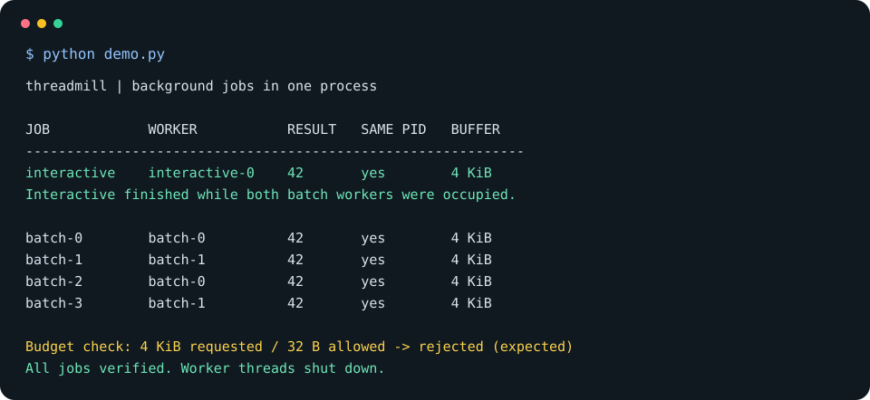

<p align="center"> <a href="https://www.python.org/"></a> <a href=".github/workflows/checks.yml"></a> </p>

**threadmill** is a multithreaded framework to run lightweight Python background jobs in one process, without runtime dependencies. It sacrifices durable execution and process execution (which tools like Airflow or Windmill provide) in exchange for sub-millisecond starts using the in-process executor.

<p align="center"></p>

## Setup

Requires macOS with [Homebrew](https://brew.sh) and Python 3.12 or newer.

```sh
git clone https://github.com/nadiaenh/threadmill.git
cd threadmill
./setup.sh
```

The optional service comparison additionally needs Docker with about 8 GiB available to its VM (`brew install --cask docker`).

## Usage

```sh
# Run demo.
python demo.py

# Unit tests for my own future reference.
python -m unittest discover -s tests -v

# Run benchmark against Airflow and Windmill.
python bench.py --jobs 1000
python bench.py --jobs 200 --sleep 0.005
```

```python
from threadmill import Lane, Scheduler


def task(ctx, payload):
    with ctx.buffer(1024):
        ctx.sleep(0.01)
        return {"answer": payload["value"] * 2}


with Scheduler({"interactive": Lane(workers=2, capacity=16)}) as scheduler:
    job = scheduler.submit(
        task, {"value": 21}, lane="interactive", timeout=1, memory_bytes=4096
    )
    print(job.result(timeout=2))  # {"answer": 42}
```

## Demo


